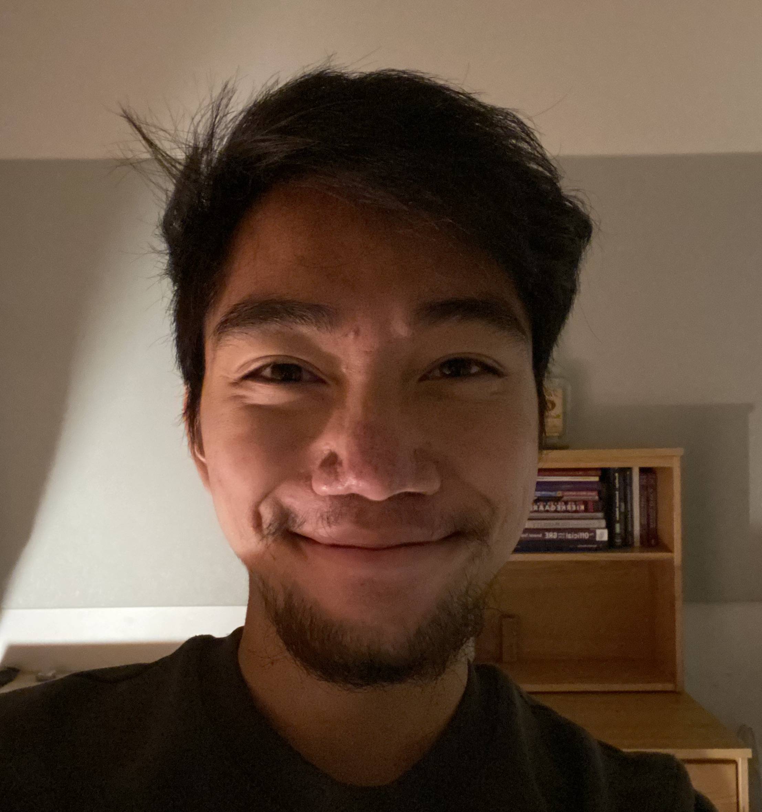

---
# Feel free to add content and custom Front Matter to this file.
# To modify the layout, see https://jekyllrb.com/docs/themes/#overriding-theme-defaults
# layout: home
layout: page
order: 1
---

<figure>
    
</figure>

My name is Phousawanh Peaungvongpakdy <i>(he/him/his)</i> and I'm a first year graduate student at Washington State University.   I graduated from Harvey Mudd College in spring 2022 with a B.Sc. in Mathematics with a concentration in philosophy.

My current research interests are in network science and the   mathematics of gerrymandering. 

Email: p dot peaungvongpakdy at wsu dot edu

